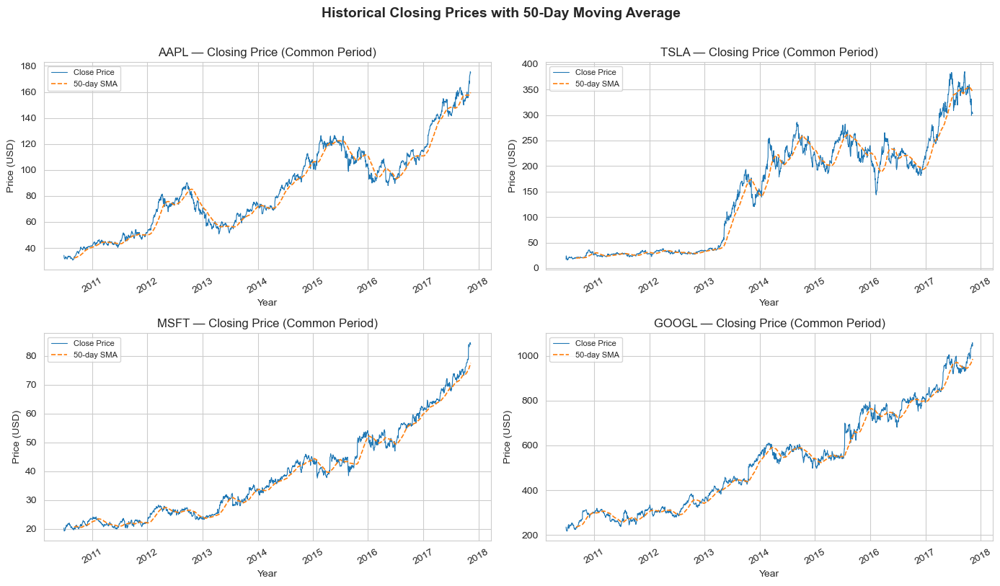
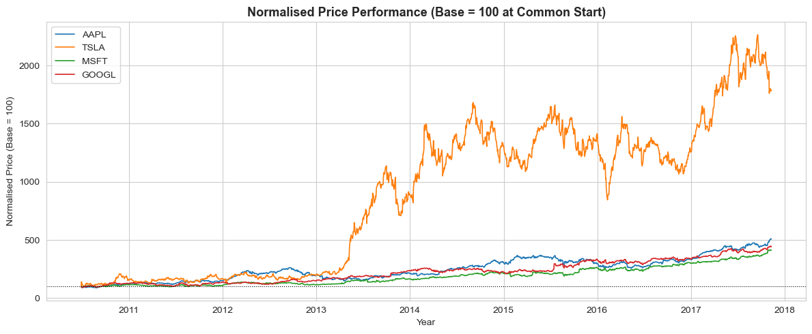
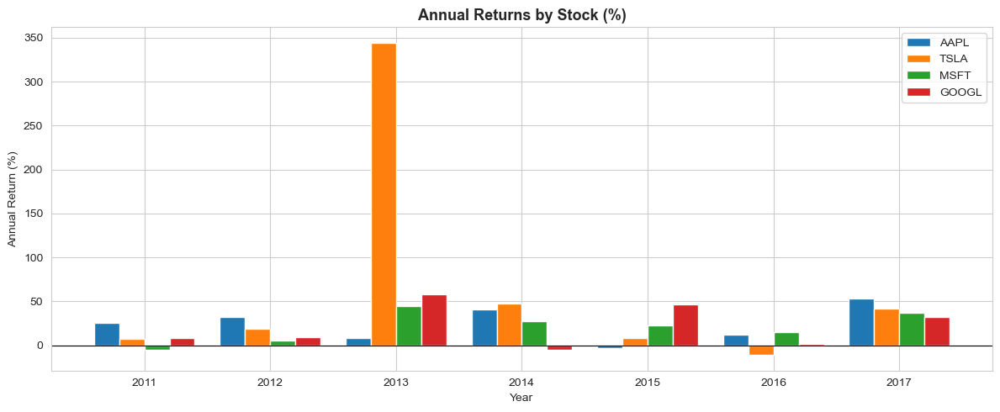
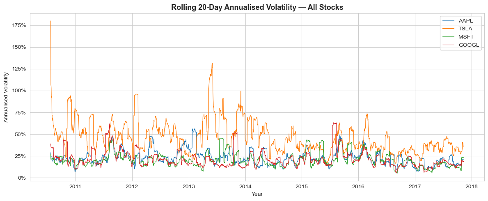
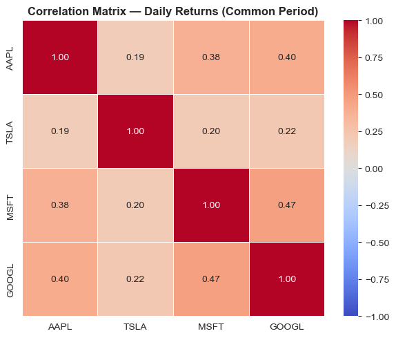
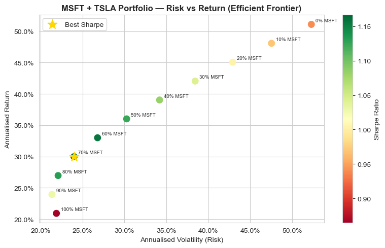

# 📈 Tech Stocks Trend & Volatility Analysis

<div align="center">


**A complete end-to-end data analyst portfolio project — from raw stock price data to an interactive Power BI dashboard.**

[View Notebook](#) · [View Dashboard](#) · [Key Findings](#-key-findings) · [Connect with Me](#-connect)

</div>

---

## 📌 Project Overview

This project performs a **comprehensive Exploratory Data Analysis (EDA)** and **statistical risk assessment** on 7+ years of historical daily OHLCV data for four major US tech stocks — **AAPL, TSLA, MSFT, and GOOGL** — using Python for all computation and Power BI for interactive visualisation.

The analysis answers a real-world business question:

> *"Which tech stock offers the best risk-adjusted return, and what is the optimal two-stock portfolio allocation for a data-driven investor?"*

---

## 🗂️ Repository Structure

```
tech-stock-analysis/
│
├── 📓 notebook/
│   └── Tech_Stock_Analysis.ipynb      ← Full Python EDA notebook (Steps 1–5)
│
├── 📊 dashboard/
│   └── Tech_Stocks_Analysis.pbix      ← Interactive Power BI dashboard (3 pages)
│
├── 📁 data/
│   ├── raw/
│   │   ├── aapl_us.csv                ← Raw AAPL OHLCV data
│   │   ├── tsla_us.csv                ← Raw TSLA OHLCV data
│   │   ├── msft_us.csv                ← Raw MSFT OHLCV data
│   │   └── googl_us.csv               ← Raw GOOGL OHLCV data
│   └── clean/
│       ├── aapl_clean.csv             ← Cleaned + feature-engineered AAPL
│       ├── tsla_clean.csv             ← Cleaned + feature-engineered TSLA
│       ├── msft_clean.csv             ← Cleaned + feature-engineered MSFT
│       └── googl_clean.csv            ← Cleaned + feature-engineered GOOGL
│
├── 🖼️ charts/
│   ├── chart1_historical_prices.png
│   ├── chart2_normalized_prices.png
│   ├── chart4_correlation_heatmap.png
│   ├── chart5_annual_returns.png
│   ├── chart6_rolling_volatility.png
│   ├── chart7_volume_analysis.png
│   ├── chart8_drawdown.png
│   ├── chart9_sharpe_ratio.png
│   ├── chart10_beta.png
│   └── chart11_portfolio_simulation.png
│
├── 📄 README.md                        ← You are here
├── 📄 LICENSE                          ← MIT License
└── 📄 .gitignore                       ← Git ignored files
```

---

## 🛠️ Tech Stack

| Tool | Purpose |
|------|---------|
| **Python 3.10+** | Core programming language |
| **pandas** | Data loading, cleaning, manipulation |
| **NumPy** | Numerical calculations |
| **Matplotlib & Seaborn** | Static chart generation |
| **Plotly** | Interactive candlestick charts |
| **SciPy** | Pearson correlation and p-values |
| **Power BI Desktop** | Interactive 3-page dashboard |

---

## 📂 Dataset

- **Source:** [Kaggle — Price Volume Data for All US Stocks & ETFs](https://www.kaggle.com/datasets/borismarjanovic/price-volume-data-for-all-us-stocks-etfs)
- **Stocks analysed:** AAPL, TSLA, MSFT, GOOGL
- **Common analysis period:** July 2010 → November 2017 (~7.5 years)
- **Data format:** Daily OHLCV (Open, High, Low, Close, Volume)

| Stock | Total Rows | History Start | Common Period |
|-------|-----------|--------------|--------------|
| AAPL | ~8,366 | Sep 1984 | Jul 2010 – Nov 2017 |
| MSFT | ~7,985 | Mar 1986 | Jul 2010 – Nov 2017 |
| GOOGL | ~3,335 | Aug 2004 | Jul 2010 – Nov 2017 |
| TSLA | ~1,860 | Jun 2010 | Jul 2010 – Nov 2017 |

---

## ⚙️ Feature Engineering

After cleaning, the following features were computed for each stock:

| Feature | Formula | Purpose |
|---------|---------|---------|
| `Daily_Return` | `Close.pct_change()` | Day-to-day % change |
| `Daily_Return_Pct` | `Daily_Return × 100` | Display-ready % |
| `SMA_20` | `rolling(20).mean()` | Short-term trend |
| `SMA_50` | `rolling(50).mean()` | Medium-term trend |
| `Volatility_20d` | `rolling(20).std() × √252` | Annualised risk |
| `RSI_14` | EWM of gains vs losses | Momentum oscillator |
| `MACD` | `EMA(12) − EMA(26)` | Trend momentum |
| `MACD_Signal` | `EMA(9) of MACD` | Signal line |
| `MACD_Hist` | `MACD − Signal` | Histogram bars |
| `BB_Upper` | `SMA_20 + 2×std` | Upper Bollinger Band |
| `BB_Lower` | `SMA_20 − 2×std` | Lower Bollinger Band |
| `Normalised_Price` | `(Close / Close[0]) × 100` | Comparable performance |
| `Drawdown` | `(Close − cummax) / cummax` | Peak-to-trough drop |

---

## 📊 Analysis Steps

### Step 1 — Data Loading
- Loaded 4 raw CSVs into a `stocks` dictionary
- Detected the common analysis period programmatically (no hard-coding)
- Verified data types, missing values, and date ranges

### Step 2 — Data Cleaning
- Converted `Date` to datetime, set as index, sorted chronologically
- Reindexed to business-day frequency using `resample('B').asfreq()` + `ffill()`
- Validated OHLC logic (High ≥ Open, Close; Low ≤ Open, Close)
- Flagged high-volume outlier days using the IQR method (`High_Vol_Flag`)

### Step 3 — Feature Engineering
- Computed all 13 engineered features listed above for all 4 stocks
- Exported clean, feature-rich CSVs for Power BI import

### Step 4 — Exploratory Data Analysis (8 charts)
- Historical prices + 50-day SMA overlay
- Normalised performance comparison (base = 100)
- Interactive Plotly candlestick (AAPL, last 6 months)
- Daily returns correlation heatmap
- Annual returns grouped bar chart
- Rolling 20-day volatility comparison
- Volume analysis with spike highlighting
- Drawdown from all-time high

### Step 5 — Statistical Analysis (3 charts)
- Annualised Sharpe Ratio (risk-free rate = 2%)
- Beta vs equal-weighted market proxy
- MSFT + TSLA portfolio simulation (efficient frontier)

---

## 🔍 Key Findings

### Stock Scorecard

| Metric | Best | Worst |
|--------|------|-------|
| Total Return (common period) | TSLA (early) / AAPL (2017) | MSFT (early years) |
| Risk-Adjusted Return (Sharpe) | TSLA (~0.94) | GOOGL (~0.86) |
| Lowest Volatility | GOOGL / MSFT | TSLA |
| Smallest Max Drawdown | GOOGL | TSLA (~−50%) |
| Best Diversifier | TSLA (lowest correlation) | MSFT–GOOGL pair |

### Top Insights

1. **TSLA delivered ~340% annual return in 2013** (Model S success + short squeeze) — but also had a ~50% drawdown in subsequent years, making it the highest-risk stock in the group.

2. **GOOGL had the most consistent performance** — positive returns in every year of the common period with the smallest maximum drawdown.

3. **MSFT showed a structural inflection point around 2013–2014** — coinciding with Satya Nadella's appointment and the Azure cloud-first strategy pivot.

4. **TSLA has the lowest correlation with other stocks** (0.19–0.22), making it the best diversifier within this group.

5. **Optimal MSFT + TSLA portfolio allocation** (maximising Sharpe Ratio): **~70% MSFT / 30% TSLA** — adding a small TSLA position improves the Sharpe Ratio without excessive risk.

---

## 🖼️ Charts Preview

<table>
  <tr>
    <td></td>
    <td></td>
  </tr>
  <tr>
    <td align="center"><em>Historical Closing Prices + 50-day SMA</em></td>
    <td align="center"><em>Normalised Price Performance (Base = 100)</em></td>
  </tr>
  <tr>
    <td></td>
    <td></td>
  </tr>
  <tr>
    <td align="center"><em>Annual Returns by Stock (%)</em></td>
    <td align="center"><em>Rolling 20-Day Annualised Volatility</em></td>
  </tr>
  <tr>
    <td></td>
    <td></td>
  </tr>
  <tr>
    <td align="center"><em>Daily Returns Correlation Matrix</em></td>
    <td align="center"><em>MSFT+TSLA Efficient Frontier</em></td>
  </tr>
</table>

---

## 📊 Power BI Dashboard

The interactive dashboard has **3 pages**, all driven by Ticker and Date slicers:

| Page | Contents |
|------|---------|
| **Page 1 — Overview** | KPI cards, Normalised price chart, Annual returns, Monthly heatmap, Candlestick |
| **Page 2 — Technical Analysis** | Price + MA + Bollinger Bands, RSI, MACD, Volume spikes |
| **Page 3 — Risk & Returns** | Volatility comparison, Drawdown, Risk vs Return scatter, Distribution histogram |

> 📁 Download `Tech_Stocks_Analysis.pbix` and open in **free Power BI Desktop** to explore interactively.

---

## 🚀 How to Run

### Python Notebook

```bash
# 1. Clone the repository
git clone https://github.com/Siddharthkeshwani/tech-stock-analysis.git
cd tech-stock-analysis

# 2. Install dependencies
pip install pandas numpy matplotlib seaborn plotly scipy

# 3. Place raw CSV files in data/raw/
# (Download from Kaggle — link in Dataset section above)

# 4. Open and run the notebook
jupyter notebook notebook/Tech_Stock_Analysis.ipynb
```

### Power BI Dashboard

1. Download and install **[Power BI Desktop](https://powerbi.microsoft.com/desktop/)** (free)
2. Download `dashboard/Tech_Stocks_Analysis.pbix`
3. Open the file in Power BI Desktop
4. If prompted about data source, update the path to `data/clean/` folder

---

## 📁 Data Notice

The raw data files are sourced from Kaggle and are subject to Kaggle's terms of use. The clean CSV files in `data/clean/` are derivatives created by this project's cleaning and feature-engineering pipeline.

---

## 📄 License

This project is licensed under the **MIT License** — see the [LICENSE](LICENSE) file for details.

---

## 🤝 Connect

<div align="center">

**Siddharth Keshwani**

[](https://github.com/Siddharthkeshwani)
[](https://www.linkedin.com/in/siddharthkeshwani/)
[](mailto:siddharthkeshwani10@gmail.com)

*If you found this project useful, a ⭐ on GitHub is always appreciated!*

</div>
